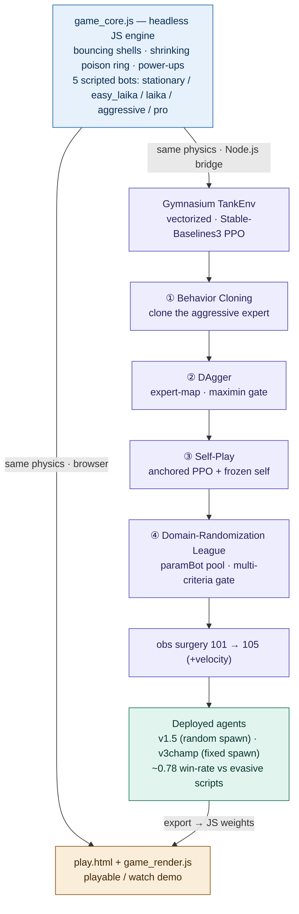

# 弹射坦克 RL（Ricochet Tanks RL）

> [English](README_en.md) ｜ 本文为中文版

一个自制的离线 2D 坦克对决竞技场，以及一项「用**模仿学习 + 自博弈**训练智能体打这款游戏」。目标是复刻弹射坦克这一品类的**策略机制**，把它当作一个强化学习试验台:

- 程序生成但固定布局的迷宫(每局地图相同)、坦克转向与撞墙碰撞
- 弹匣容量5颗，无限上弹，炮弹会弹射
- 限时道具、不断收缩的毒圈、呼吸式回血
- 可与脚本机器人 **以及一个导出的神经网络策略** 进行 1v1 对决
- **随机出生点**(高难设定) 与 **固定出生点**(对称竞技场)
- 游戏内置了多个辅助训练的 rule-based bots,主要包括:`laika` 防守型强脚本、`easy_laika` 慢动作弱脚本、`stationary` 不动靶、`pro` 均衡型强脚本、`laika-aggressive` 进攻型强脚本。

---

## ▶ 玩 / 观战(免安装、免服务器)

**克隆/下载仓库后**,在本地用浏览器打开 **`play.html`** 即可。

> 直接在 GitHub 网页上点 `play.html` 只会显示源码、不会运行游戏。要在线玩,请在仓库 **Settings → Pages** 启用 GitHub Pages,然后访问:`https://botknqp.github.io/Ricochet-Tanks-RL/play.html`

- **🎮 与智能体对战** —— 你开一辆坦克(红方方向键+回车 或 蓝方WASD+空格),训练好的神经网络开另一辆。选一边,点击竞技场捕获键盘。
- **👁 观战智能体** —— 旁观智能体 vs 脚本机器人,带实时胜率计数;可在页面内切换对手、速度、阵营。
- 顶部条三个下拉:**蓝方控制器 / 红方控制器 / 地图模式**。红方只放脚本和玩家(智能体只在蓝方训练过,放到红方会出现离群行为,因此你只能作为红方对战智能体)。

默认智能体(★ *v1.5 随机出生专用*)是一个 **105 维状态、对手身份盲**(永远看不到对手名字)的策略。另一个固定出生点的更强模型是 **v3champ / 固定出生点冠军**。`index.html` 是更完整的开发者页面(含全部训练课程与录制链接)。

---

## 📊 结论

- **随机出生点**: 部署的 v1.5 智能体(一个对莽撞脚本做 DAgger 克隆、再经自博弈打磨的策略)对四个 rule-based 对手 `{laika, easy_laika, stationary, pro}` 平均胜率 **~0.59**。唯一攻不下的是**闪避型 `laika` 狙击手**(~0.30,而强脚本能打到 ~0.63)——这是一堵有完整记录的**开火时机转化墙**,扛住了六种独立尝试(RL、克隆、贴近/瞄准/封角奖励、预判瞄准观测特征)。
  > 注:该随机出生点评测采用 reduced opponent pool,**明确排除了 `laika-aggressive`** —— 它正是 v1.5 智能体 DAgger 克隆的来源专家(近似自我镜像),会引入与当前目标不同的镜像/互克问题,完整讨论见 [`docs/JOURNAL.md`](docs/JOURNAL.md)。
- **固定出生点**: 总体成功，`v3champ` 冠军在严格复核(120 局/对手 × 4 seed-base)下 **3/4 稳过 5 成**——laika **0.78** / easy_laika **0.78** / stationary **0.98**,对莽撞 pro **0.46**(五五开)。

固定出生点冠军训练史 + reward 参数见 [`docs/TRAINING_HISTORY.md`](docs/TRAINING_HISTORY.md)。

### 固定出生点规则下，使用Elo 排位赛对各模型实力进行严格评估

各阶段模型(裸BC → DAgger → 联赛PPO → 域随机联赛 → 冠军)与整个 laika 家族脚本同场竞技,座位均衡(每对双向各打同样局数,抵消蓝方先手优势),起始 1000 Elo,迭代至稳定。严格评估与排行榜见 [`docs/LADDER.md`](docs/LADDER.md),用 `bash _ladder_run.sh 60 12` 即可复现(读取已提交的 `ladder_weights.js`)。

---

## 🔧 架构与训练流程

单一无头引擎 `game_core.js` 同时驱动浏览器 demo 与 Python 训练;智能体经 **模仿学习 → 自博弈联赛** 训练后,再导出为浏览器权重,形成闭环。



---

## 仓库结构

```
play.html                 ← 可玩/可观战的 demo(从这里开始)
index.html, styles.css    ← 开发者页面 + 共享样式
game_core.js              ← 权威的无头物理 + 脚本机器人 + reward(与训练共用)
game_render.js            ← 浏览器画布/输入层,封装 game_core
model_weights_v15clone.js ← v1.5 随机出生智能体的浏览器权重(纯 JS,可直接运行)
model_weights_v3champ.js  ← 固定出生点冠军的浏览器权重(纯 JS,可直接运行)
ladder_weights.js         ← Elo 排位赛 6 个模型的合并权重(排位赛直接读取)
_champ_eval.js            ← 固定出生点冠军严格复核(120 局/对手)
_ladder_worker.js / _ladder_rank.js / _ladder_run.sh ← 固定出生点 Elo 排位赛(并行、座位均衡、Bradley–Terry)
docs/                     ← 实验记录(TRAINING_HISTORY、LADDER、JOURNAL …)
train/                    ← Python RL 工具链(BC/DAgger/自博弈 训练器、环境、评测、obs 手术、Node 桥)
models/                   ← 关键 checkpoint(小体积 .zip;v1.5/联赛模型的完整 .zip 因 >25MB 未收录)
smoke_*.js, smoke_bc.py   ← 回归 / 冒烟测试
```

---

## 大文件与完整实验归档

为保持仓库轻量并满足单文件 ≤25MB 的上传限制,以下文件**未随 GitHub 仓库提供**:

| 路径 / 文件 | demo 必需 | 说明 |
|---|:---:|---|
| `.venv/` | 否 | 本地 Python 虚拟环境,`pip install -r requirements-rl.txt` 重建 |
| `data/` | 否 | 训练示范数据,`node train/record_v2_demos.js` 重新生成 |
| `runs/` | 否 | 训练输出、日志、曲线、中间评估结果,重跑训练即可获得 |
| `models/auto/v15_league_agent.zip` | 否 | 完整 SB3 checkpoint 体积较大;其浏览器可运行权重已导出到 `model_weights_v15clone.js` 与 `ladder_weights.js` |

浏览器 demo、观战模式、Elo ladder 与核心评测脚本**均不依赖**这些大文件 —— 它们只在 continue-training、复现训练日志、核对完整 checkpoint 时才需要。

**可选完整归档**:

```text
Full artifacts mirror: optional, not required for running the demo. Coming soon.
Contents: models/auto/v15_league_agent.zip + data/ + runs/   (不含 .venv/ 与 .git/)
```

> 来源优先级:**GitHub 仓库**(源码 + 浏览器权重 + 小型复现脚本)→ **GitHub Releases / Hugging Face / Zenodo**(完整 checkpoint / demos / runs)→ **Quark 网盘**(中国访问镜像,可选)。外部归档建议附 `SHA256` 校验值;项目运行**不应**依赖任何外部网盘。

---

## 环境与依赖

浏览器 demo **不需要 Python 环境** —— 直接打开 `play.html` 即可运行已导出的 JS 权重。

如需运行训练、评测、导出模型或重新生成实验结果,需安装 Node.js 与 Python 依赖。建议 **Python 3.10–3.12**;本项目主要在 Windows + Python 3.12 环境下开发和测试(Python 3.13 下 SB3/Torch 可能装不上)。

```bash
# 建议使用虚拟环境;.venv 不随仓库上传
python -m venv .venv
# Windows PowerShell
.\.venv\Scripts\Activate.ps1
# macOS / Linux
source .venv/bin/activate
pip install -r requirements-rl.txt
```

主要 Python 依赖(见 `requirements-rl.txt`):`stable-baselines3` · `gymnasium` · `torch` · `numpy` · `tensorboard`(`matplotlib` 仅 `docs/` 画图脚本用)。

**Node.js** 用于运行无头 JS 环境、评测脚本、回归测试与浏览器权重导出;运行核心 demo 与多数评测脚本**无需额外 npm 包**。

---

## 复现

需要 Node.js(JS 核心 + 桥)与 Python + `requirements-rl.txt`(stable-baselines3 / gymnasium)。

```bash
# 回归:引擎在无头与浏览器下逐字节一致
node smoke_core.js && node smoke_moba1v1duel.js && node train/verify_rules.js

# 评测部署智能体 vs 对手家族(用 >=200 局——laika 这一格 seed 方差极大)
node train/eval_v2_agent.js --policy <exported.json> --ruleset survival_v1 --spawn half_random \
  --train "laika,easy_laika,pro" --held stationary --episodes 50 --seeds 300000,500000,700000,900000

# 固定出生点冠军的严格复核(120 局/对手 × 4 seed-base)
node _champ_eval.js

# 固定出生点 Elo 排位赛(直接读取已提交的 ladder_weights.js)
bash _ladder_run.sh 60 12            # 跑排位赛,输出排行榜
# (可选)重训后重新生成 ladder_weights.js(需各阶段 checkpoint):python train/export_ladder.py

# 重新训练(BC/DAgger 克隆 -> 自博弈);完整配方见 docs/JOURNAL.md 与 docs/TRAINING_HISTORY.md
python train/train_dagger.py  --help
python train/train_selfplay.py --help
```

(用 `train/export_policy.py` / `export_for_browser.py` 把 `.zip` 策略导出为浏览器/JSON 形式。)

---

## 许可

见 [`LICENSE`](LICENSE)。完全自研实现——不含任何第三方游戏素材或品牌。
