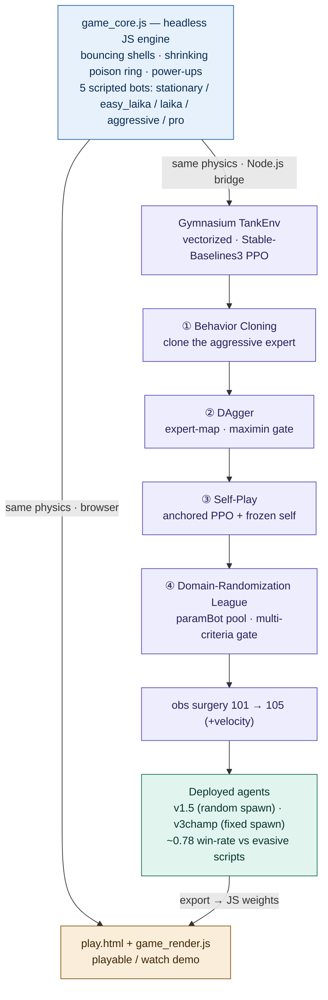

# Ricochet Tanks RL

> [中文](README.md) ｜ English

A self-made, offline 2D tank-duel arena and a study of training an agent to play it with **imitation +
self-play**. The goal is to reproduce the *strategic mechanics* of the ricochet-tank genre as an RL testbed:


- a procedurally generated but fixed-layout maze (same map every episode), tank steering and wall collision
- magazine of 5 shots, unlimited reloads, **ricocheting** shells
- timed power-ups, a shrinking poison ring, breathing health regen
- 1v1 duels vs scripted bots **and an exported neural policy**
- **random spawn** (the hard setting) and **fixed spawn** (a symmetric arena)
- built-in rule-based bots used as training opponents:
  `{laika = strong defensive script, easy_laika = slow weak script, stationary = sitting target,
  pro = strong balanced script, laika-aggressive = strong aggressive script}`

---

## ▶ Play / watch (no install, no server)

**Clone/download the repo**, then open **`play.html`** in any modern browser.

> Clicking `play.html` on the GitHub file view only shows the source — it won't run the game. To play online, enable GitHub Pages (repo **Settings → Pages**) and visit `https://botknqp.github.io/Ricochet-Tanks-RL/play.html`

- **🎮 Play vs the agent** — you drive one tank (red: arrows + Enter, or blue: WASD + Space), the trained neural
  agent drives the other. Pick a side and click the arena to capture keys.
- **👁 Watch the agent** — spectate the agent vs a scripted bot with a live win-rate counter; switch opponent,
  speed, and side in-page.
- The top bar has three dropdowns: **blue controller / red controller / map mode**. Red is scripts + player only
  (the agent was trained only as blue; on red it behaves off-distribution — so you can only face the agent as red).

The default agent (★ *v1.5, random-spawn specialist*) is a **105-dimensional, identity-blind** policy (it never
sees the opponent's name). The stronger fixed-spawn model is **v3champ / the fixed-spawn champion**. `index.html`
is the fuller developer page (all training lessons / recording links).

---

## 📊 Results

- **Random spawn**: the deployed v1.5 agent (a DAgger clone of an aggressive script, refined by self-play) wins
  **~0.59 mean** vs the four-opponent family `{laika, easy_laika, stationary, pro}`. The one matchup it cannot
  crack is the **evasive `laika` sniper** (~0.30, where the strong script reaches ~0.63) — a documented
  **fire-timing conversion wall** that survived six independent attempts (RL, cloning, proximity/aim/cornering
  rewards, a predictive-aim observation feature).
  > Note: this random-spawn eval uses a **reduced opponent pool that deliberately excludes `laika-aggressive`** — it is the very expert the v1.5 agent was DAgger-cloned from (a near-self-mirror) and introduces mirror / mutual-counter dynamics orthogonal to the current goal; full discussion in [`docs/JOURNAL.md`](docs/JOURNAL.md).
- **Fixed spawn**: overall success — under rigorous re-evaluation (120 ep/opp × 4 seed-bases) the `v3champ`
  champion **clears 3/4 above 50%**: laika **0.78** / easy_laika **0.78** / stationary **0.98**, and the reckless
  pro **0.46** (a coin-flip).

The champion's full training history + reward parameters are in
[`docs/TRAINING_HISTORY_en.md`](docs/TRAINING_HISTORY_en.md).

### Rigorous strength assessment via an Elo ranked ladder (fixed spawn)

Every stage model (naked BC → DAgger → league PPO → DR league → champion) competes against the whole laika
family of scripts. Seats are balanced (each pair plays equal games on each side, cancelling the blue first-mover
edge); ratings start at 1000 and are fit to the stable Bradley–Terry point the ladder converges to. The full
assessment and leaderboard are in [`docs/LADDER.md`](docs/LADDER.md); reproduce with
`bash _ladder_run.sh 60 12` (reads the committed `ladder_weights.js`).

---

## 🔧 Architecture & training pipeline

A single headless engine (`game_core.js`) drives both the browser demo and Python training; agents are trained via **imitation → self-play league**, then exported back to browser weights — closing the loop.



---

## Repository layout

```
play.html                 ← the playable/watchable demo (start here)
index.html, styles.css    ← developer page + shared styles
game_core.js              ← authoritative headless physics + scripted bots + reward (shared with training)
game_render.js            ← browser canvas/input glue over game_core
model_weights_v15clone.js ← v1.5 random-spawn agent's browser weights (pure JS, runnable as-is)
model_weights_v3champ.js  ← fixed-spawn champion's browser weights (pure JS, runnable as-is)
ladder_weights.js         ← merged weights of the 6 ladder models (read directly by the ladder)
_champ_eval.js            ← rigorous fixed-spawn champion eval (120 ep/opp)
_ladder_worker.js / _ladder_rank.js / _ladder_run.sh ← fixed-spawn Elo ladder (parallel, seat-balanced, BT)
docs/                     ← experiment records (TRAINING_HISTORY, LADDER, JOURNAL, ...)
train/                    ← Python RL toolchain (BC/DAgger/self-play trainers, env, eval, obs-surgery, Node bridge)
models/                   ← key checkpoints (small .zip; full v1.5/league .zip omitted, >25MB)
smoke_*.js, smoke_bc.py   ← regression / smoke tests
```

---

## Large files & full artifact archive

To keep the repo lean and within the ≤25MB-per-file upload limit, these are **not shipped in the GitHub repo**:

| Path / file | needed for demo | note |
|---|:---:|---|
| `.venv/` | no | local Python virtualenv — rebuild with `pip install -r requirements-rl.txt` |
| `data/` | no | training demonstrations — regenerate with `node train/record_v2_demos.js` |
| `runs/` | no | training outputs, logs, curves, intermediate evals — re-run training to get them |
| `models/auto/v15_league_agent.zip` | no | the full SB3 checkpoint is large; its runnable browser weights are already exported into `model_weights_v15clone.js` and `ladder_weights.js` |

The browser demo, watch mode, the Elo ladder, and the core eval scripts **do not depend on any of these** — they're only needed for continue-training, reproducing training logs, or inspecting the full checkpoint.

**Optional full archive:**

```text
Full artifacts mirror: optional, not required for running the demo. Coming soon.
Contents: models/auto/v15_league_agent.zip + data/ + runs/   (excludes .venv/ and .git/)
```

> Source priority: **GitHub repo** (source + browser weights + small repro scripts) → **GitHub Releases / Hugging Face / Zenodo** (full checkpoints / demos / runs) → **Quark netdisk** (China-access mirror, optional). Provide a `SHA256` for any external archive; running the project should **never** depend on an external netdisk.

---

## Environment & dependencies

The browser demo needs **no Python** — just open `play.html` and it runs the exported JS weights.

To run training, evaluation, model export, or to regenerate results, install Node.js and the Python deps.
**Python 3.10–3.12 is recommended**; developed and tested mainly on Windows + Python 3.12 (SB3/Torch may fail to install on Python 3.13).

```bash
# a virtualenv is recommended; .venv is never uploaded
python -m venv .venv
# Windows PowerShell
.\.venv\Scripts\Activate.ps1
# macOS / Linux
source .venv/bin/activate
pip install -r requirements-rl.txt
```

Main Python deps (see `requirements-rl.txt`): `stable-baselines3` · `gymnasium` · `torch` · `numpy` · `tensorboard` (`matplotlib` is only for the `docs/` figure scripts).

**Node.js** runs the headless JS env, eval scripts, regression tests, and browser-weight export; the core demo and most eval scripts need **no extra npm packages**.

---

## Reproduce

Requires Node.js (the JS core + bridge) and Python with `requirements-rl.txt` (stable-baselines3 / gymnasium).

```bash
# regression: the engine is byte-identical headless vs browser
node smoke_core.js && node smoke_moba1v1duel.js && node train/verify_rules.js

# evaluate the deployed agent vs the opponent family (use >=200 ep — the laika matchup is very seed-variable)
node train/eval_v2_agent.js --policy <exported.json> --ruleset survival_v1 --spawn half_random \
  --train "laika,easy_laika,pro" --held stationary --episodes 50 --seeds 300000,500000,700000,900000

# rigorous fixed-spawn champion check (120 ep/opp × 4 seed-bases)
node _champ_eval.js

# fixed-spawn Elo ladder (reads the committed ladder_weights.js)
bash _ladder_run.sh 60 12            # run the ladder, write the leaderboard
# (optional) regenerate ladder_weights.js after retraining (needs stage checkpoints): python train/export_ladder.py

# retrain (BC/DAgger clone -> self-play); full recipe in docs/JOURNAL.md and docs/TRAINING_HISTORY_en.md
python train/train_dagger.py  --help
python train/train_selfplay.py --help
```

(Export a `.zip` policy to browser/JSON form with `train/export_policy.py` / `export_for_browser.py`.)

---

## License

See [`LICENSE`](LICENSE). Clean-room implementation — no third-party game assets or branding.
